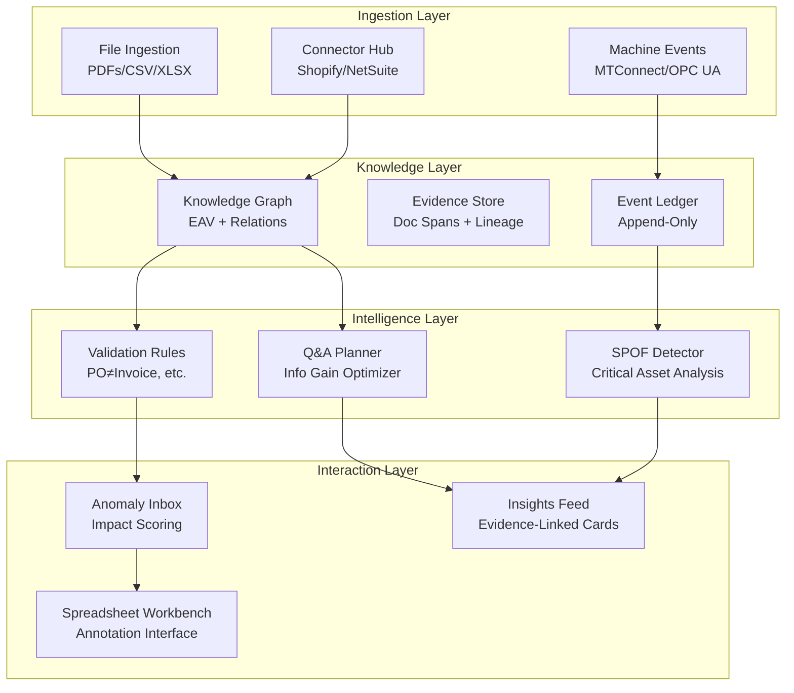

# DigitalTwin2 - Architecture Overview

## System Vision

**DigitalTwin2** is an intelligent manufacturing analytics platform that transforms scattered business documents and machine telemetry into actionable insights through evidence-based questioning and automated anomaly detection.

## Core Principles

### 1. **Evidence-First Architecture**
- Every insight must be traceable to source evidence
- Document spans (page, bbox) linked to extracted facts
- Event lineage from machine to cluster delivery
- Non-destructive fact versioning with audit trails

### 2. **Question-Efficient Intelligence**
- Maximize information gain per human interaction
- ACL-aware question routing by data room permissions
- Budget-constrained questioning (≤10 questions to converge)
- Oracle-based testing against optimal question plans

### 3. **Privacy-Safe Cross-BU Analytics**
- Raw data segregated by `dataroom_id` claims
- Cross-BU insights via aggregated projections only
- Zero cross-contamination in anomaly workbenches
- Audit trails for all data access and modifications

### 4. **Real-Time SPOF Detection**
- Bipartite graph analysis: Products ↔ Routings ↔ Machines
- Revenue-at-Risk calculations from invoice streams
- Centrality scoring with Expected Lost Throughput (ELT)
- Sub-5-minute detection from live machine events

## System Architecture



## Component Details

### **Knowledge Graph (P1)**
- **EAV Model**: Flexible entity-attribute-value with versioning
- **Relations**: Typed relationships between entities (e.g., Product → Machine)
- **Evidence**: Document coordinates, OCR confidence, extraction metadata
- **Events**: Immutable append-only ledger with temporal ordering

### **File→Facts Pipeline (P2)**  
- **Classifiers**: Document type detection (invoice, PO, job card, etc.)
- **Extractors**: Pluggable adapters for PDF tables, CSV parsing, XLSX reading
- **Mappers**: Domain-specific field mapping to canonical facts
- **Confidence**: Extraction confidence (OCR: 0.6, native: 0.9, manual: 1.0)

### **Validation Engine (P3)**
- **Rule Packs**: Configurable business rules (PO vs Invoice totals, negative quantities)
- **Temporal Rules**: Time-based validations (stale vendor masters, delivery timing)
- **Cross-Silo Rules**: Multi-document consistency checks
- **Impact Scoring**: Business impact assessment (High/Medium/Low)

### **Q&A Planner (P5)**
- **Unknowns Model**: Entropy tracking across business units
- **Question Templates**: Parameterized question patterns with slot-filling
- **Information Gain**: Posterior probability reduction estimation
- **ACL Routing**: Question delivery based on data room permissions

### **SPOF Detector (P7)**
- **Graph Construction**: Bipartite product-routing-machine networks
- **Centrality Analysis**: Betweenness and flow centrality calculations
- **Risk Scoring**: ELT × RaR × Centrality normalized scoring
- **Simulation**: Counterfactual outage impact modeling

## Data Flow Patterns

### **Ingest → Normalize → Validate → Question → Resolve**

1. **Documents** uploaded → **Classified** → **Extracted** → **Facts** with **Evidence**
2. **Events** streamed → **Normalized** → **Stored** in **Event Ledger**
3. **Facts** processed → **Validation Rules** → **Anomalies** with **Impact Scores**
4. **Unknowns** identified → **Q&A Planner** → **Questions** routed to **Users**
5. **Answers** received → **New Facts** → **Insights** with **Evidence Links**

### **Privacy Boundaries**

```
┌─────────────────┐    ┌─────────────────┐    ┌─────────────────┐
│   DataRoom A    │    │   DataRoom B    │    │   Cross-BU      │
│                 │    │                 │    │                 │
│ Raw Facts       │    │ Raw Facts       │    │ Aggregates Only │
│ Full Evidence   │    │ Full Evidence   │    │ KPI Summaries   │
│ Direct Q&A      │    │ Direct Q&A      │    │ Trend Analysis  │
└─────────────────┘    └─────────────────┘    └─────────────────┘
        │                        │                        ▲
        └────────────────────────┼────────────────────────┘
                                 │
                        ┌─────────────────┐
                        │  Privacy Filter │
                        │  & Aggregator   │
                        └─────────────────┘
```

## Technology Stack

### **Backend**
- **.NET 8**: Core framework with minimal APIs
- **Entity Framework Core**: Data access with SQLite (dev) / PostgreSQL (prod)
- **SignalR**: Real-time updates for machine events and insights
- **Serilog**: Structured logging with correlation tracking

### **Frontend**
- **Blazor WebAssembly**: PWA with offline capabilities
- **SignalR Client**: Real-time dashboard updates
- **Custom Grid Component**: High-performance spreadsheet workbench

### **Data Storage**
- **Relational**: EF Core with EAV schema
- **Document**: File storage with metadata indexing
- **Time-Series**: Event ledger with temporal queries
- **Graph**: In-memory for SPOF analysis (NetworkX via Python microservice)

### **DevOps**
- **Docker**: Containerized deployment
- **GitHub Actions**: CI/CD with nightly test rig execution
- **Test Rig**: Scenario-driven KPI measurement with PDF reports

## Performance Characteristics

### **Target KPIs (MVP)**
- **TTAI**: Time-to-Actionable Insight ≤ 60 minutes
- **IG@10**: Information Gain at 10 questions ≥ 60%
- **QBR**: Question Budget Ratio ≤ 0.4
- **ECR**: Evidence Coverage Ratio ≥ 95%
- **SPOF-Recall**: Critical asset detection ≥ 0.9

### **System Performance**
- **API Response Time**: p95 < 500ms
- **File Processing**: 1000+ documents/hour
- **Real-Time Events**: <5s machine-to-dashboard latency
- **Query Performance**: <100ms for standard fact lookups

## Security Model

### **Authentication & Authorization**
- **JWT Tokens**: With `dataroom_id` claims for isolation
- **ABAC Policies**: Attribute-based access control
- **Row-Level Security**: Database-enforced data room boundaries

### **Data Protection**
- **PII Redaction**: Automatic scrubbing in logs and exports
- **Evidence Access**: Audit trails for all document access
- **Cross-BU Projections**: Aggregated views only, no raw data leakage

### **Compliance**
- **Data Retention**: Configurable policies per data room
- **Audit Trails**: Immutable change logs with evidence
- **Secrets Management**: Environment variables and key vaults only

## Deployment Architecture

### **Development**
```
Developer Machine
├── MAK3R.Api (localhost:5225)
├── MAK3R.PWA (localhost:5173)
├── MAK3R.Edge (localhost:9080)
└── SQLite Database (mak3r.db)
```

### **Production**
```
Kubernetes Cluster
├── API Pod (3 replicas)
├── PWA Pod (2 replicas) 
├── Edge Pods (per site)
├── PostgreSQL (managed)
└── Redis (SignalR backplane)
```

## Next Steps

1. **P1 Implementation**: EAV knowledge graph with evidence tracking
2. **P2 Pipeline**: File ingestion with confidence-based fact extraction
3. **P3 Validators**: Business rule engine with anomaly detection
4. **P5 Q&A Engine**: Information gain optimization with ACL routing
5. **Test Rig**: Scenario-based KPI measurement framework