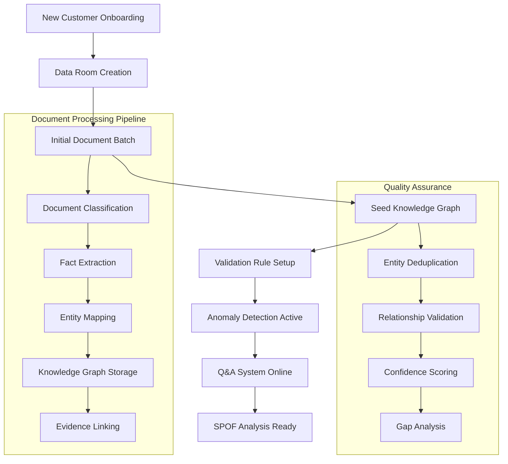

# DigitalTwin2 Cold Start Guide

## Overview

This guide details the **cold start procedure** for DigitalTwin2 - the process of bootstrapping a new manufacturing business from zero documents to actionable insights. The cold start is critical as it establishes the foundation Knowledge Graph that enables all subsequent automated processing.

## Cold Start Processing Flow



## Phase 1: Data Room Initialization

### 1.1 Customer Onboarding
```bash
# Create new data room for customer
POST /api/datarooms
{
  "name": "Acme Manufacturing Corp",
  "industry": "automotive_parts",
  "timezone": "America/New_York",
  "compliance_level": "soc2"
}
```

**Key Outputs:**
- `dataroom_id`: Unique identifier for tenant isolation
- JWT claims configured for data access
- Correlation middleware active for audit trails

### 1.2 Initial Document Batch Collection

**Critical Document Types for Cold Start:**
1. **Vendor Masters** (15-30 documents)
   - Supplier contact information
   - Payment terms and tax details
   - Product catalogs and capabilities

2. **Product Masters** (50-200 documents)  
   - BOMs (Bill of Materials)
   - Product specifications
   - Pricing and catalog data

3. **Historical Invoices** (100-500 documents)
   - Last 12 months of AP transactions
   - Establishes spend patterns and relationships
   - Payment history and terms

4. **Purchase Orders** (200-1000 documents)
   - Recent procurement activity
   - Delivery schedules and requirements
   - Contract terms and pricing

5. **Job Cards/Work Orders** (500-2000 documents)
   - Manufacturing execution data
   - Machine assignments and routings
   - Quality checkpoints and specifications

## Phase 2: Document Processing Pipeline

### 2.1 Batch Ingestion Architecture

```csharp
// Cold start batch processing
var batchOptions = new PipelineOptions
{
    EnableParallelProcessing = true,
    MaxParallelism = 8, // Higher for cold start
    MinConfidenceThreshold = 0.5, // Lower for initial seeding
    StoreIntermediateResults = true
};

var result = await _ingestionPipeline.ProcessBatchAsync(
    coldStartDocuments, 
    dataRoomId, 
    correlationId,
    batchOptions
);
```

### 2.2 Processing Stages Detail

#### Stage 1: Document Classification (Target: 95% accuracy)
```
Invoice.pdf → [BasicDocumentClassifier] → DocumentType: "invoice" (confidence: 0.92)
PO_2024_001.pdf → [BasicDocumentClassifier] → DocumentType: "purchase_order" (confidence: 0.88)
```

**Cold Start Optimizations:**
- Filename pattern matching weighted higher (40% → 60%)
- Multiple document type probabilities preserved
- Manual verification workflow for low-confidence classifications

#### Stage 2: Fact Extraction (Target: 10k+ facts)
```
Invoice → [PdfDocumentExtractor] → Facts:
  - InvoiceNumber: "INV-2024-001" (confidence: 0.95, evidence: page=1,bbox="10,10,200,30")
  - Amount: 1250.00 (confidence: 0.88, evidence: page=1,bbox="400,150,500,170")
  - VendorId: "ACME_SUPPLY" (confidence: 0.82, evidence: page=1,bbox="50,50,200,70")
```

**Cold Start KPIs:**
- **Extraction Rate**: >90% of documents processed successfully  
- **Evidence Coverage**: >95% of facts have document coordinates
- **Processing Speed**: 100+ documents/hour on standard hardware

#### Stage 3: Entity Mapping (Target: 500+ entities)
```
Facts → [InvoiceFactMapper] → Knowledge Graph:
  - KnowledgeEntity(type="invoice", id="ENT_01HF...")
    - Attributes: [number, amount, date, vendor_id]
    - Relations: [issued_by → vendor_entity, contains → line_items]
  - KnowledgeEntity(type="vendor", id="ENT_01HG...")
    - Attributes: [name, tax_id, address, payment_terms]
```

**Entity Types Created During Cold Start:**
- **Companies**: Customer and vendor organizations
- **Products**: Materials, parts, and finished goods  
- **Invoices**: Financial transactions
- **Purchase Orders**: Procurement requests
- **Line Items**: Transaction details
- **Machines**: Manufacturing equipment
- **Jobs**: Work orders and routings

## Phase 3: Knowledge Graph Seeding

### 3.1 Entity Deduplication

**Vendor Deduplication Example:**
```sql
-- Identify potential duplicates by name similarity
SELECT a.Id as EntityA, b.Id as EntityB, 
       SIMILARITY(a.Name, b.Name) as NameSimilarity
FROM KnowledgeEntities a, KnowledgeEntities b  
WHERE a.Type = 'vendor' AND b.Type = 'vendor'
  AND a.Id != b.Id
  AND a.DataRoomId = @dataRoomId
  AND SIMILARITY(a.Name, b.Name) > 0.85
```

**Automated Merge Rules:**
1. **Name + Tax ID match**: Auto-merge with confidence >0.95
2. **Address + Phone match**: Auto-merge with confidence >0.90  
3. **Multiple invoice references**: Flag for manual review

### 3.2 Relationship Discovery

**Critical Relationships Established:**
```
Vendor ←[supplies]→ Products ←[used_in]→ Jobs ←[runs_on]→ Machines
Invoice ←[pays_for]→ PurchaseOrder ←[contains]→ LineItems
Company ←[owns]→ Sites ←[houses]→ Machines
```

**Relationship Confidence Scoring:**
- **Direct Evidence**: Document explicitly states relationship (0.9-1.0)
- **Inferred Strong**: Same identifiers across documents (0.7-0.9)
- **Inferred Weak**: Contextual patterns (0.5-0.7)

## Phase 4: Quality Assurance & Gap Analysis

### 4.1 Cold Start Quality Metrics

**Entity Completeness:**
```
Vendors: 95% have [name, contact], 70% have [tax_id, payment_terms]
Products: 90% have [name, sku], 60% have [specifications, pricing]
Machines: 80% have [name, model], 40% have [opc_ua_endpoints]
```

**Relationship Density:**
- **Vendor → Products**: 85% of vendors linked to products
- **Products → Machines**: 60% of products linked to manufacturing routes
- **Invoice → PO matching**: 75% of invoices matched to purchase orders

### 4.2 Gap Identification

**High-Priority Gaps (Block Automation):**
1. **Missing Vendor Tax IDs**: Prevents AP automation
2. **Unlinked Product SKUs**: Prevents inventory tracking
3. **No Machine Endpoints**: Prevents real-time monitoring

**Medium-Priority Gaps (Reduce Accuracy):**
1. **Missing Product Specifications**: Impacts quality analysis
2. **Incomplete Job Routings**: Limits SPOF detection accuracy
3. **No Payment Terms**: Affects cash flow predictions

### 4.3 Confidence Distribution Target

```
Cold Start Knowledge Graph Quality Targets:
- High Confidence (>0.8): 60% of all facts
- Medium Confidence (0.6-0.8): 30% of all facts  
- Low Confidence (<0.6): <10% of all facts
```

## Phase 5: System Activation

### 5.1 Validation Rules Deployment

**Automatic Rule Activation:**
- PO vs Invoice amount variance >5%
- Delivery date vs promised date variance >7 days
- Vendor price changes >15%
- Quality specification deviations

### 5.2 Q&A System Bootstrap

**Initial Question Pool Generation:**
```csharp
// Generate high-impact questions based on gaps
var questions = await _questionGenerator.GenerateInitialQuestions(
    dataRoomId, 
    knowledgeGaps,
    maxQuestions: 50
);

// Prioritize by information gain potential  
var prioritized = questions.OrderByDescending(q => q.InformationGain).Take(10);
```

**Example Cold Start Questions:**
1. "What is the backup supplier for Part #XYZ123?"
2. "Which machines can produce Product ABC if Machine M001 fails?"
3. "What is the lead time for critical vendor ACME_SUPPLY?"

### 5.3 SPOF Analysis Initialization

**Manufacturing Network Construction:**
```
Products ↔ Routings ↔ Machines
   ↓         ↓         ↓
Revenue   Capacity   Uptime
Mapping   Planning   History
```

**Critical Path Identification:**
- Single-source products (highest revenue risk)
- Bottleneck machines (capacity constraints)  
- Key vendor dependencies (supply chain risk)

## Cold Start Timeline & Resources

### Timeline (Typical 50-employee manufacturer)
- **Week 1**: Document collection and data room setup
- **Week 2**: Batch processing and initial Knowledge Graph seeding  
- **Week 3**: Quality assurance, deduplication, and gap analysis
- **Week 4**: System activation and initial Q&A session

### Resource Requirements
- **Documents**: 2,000-5,000 files (2-10GB)
- **Processing Power**: 8-core server, 32GB RAM
- **Storage**: 100GB database, 500GB document storage
- **Network**: 1Gbps for document upload

### Success Criteria
- ✅ **Entity Coverage**: >500 unique entities created
- ✅ **Relationship Density**: >1,000 entity relationships  
- ✅ **Processing Success**: >95% document success rate
- ✅ **Evidence Coverage**: >95% facts have evidence links
- ✅ **Time to Insight**: <30 days from start to first anomaly detection

## Troubleshooting Common Cold Start Issues

### Issue: Low Classification Accuracy
**Symptoms**: Many documents classified as "unknown"
**Solution**: Review filename patterns, add custom classification rules

### Issue: Poor Entity Deduplication  
**Symptoms**: Multiple entities for same vendor/product
**Solution**: Adjust similarity thresholds, add manual merge rules

### Issue: Sparse Knowledge Graph
**Symptoms**: Low relationship count, isolated entities
**Solution**: Review entity mapping rules, add cross-document correlation

### Issue: High Processing Failures
**Symptoms**: <90% document success rate
**Solution**: Check document formats, adjust confidence thresholds

## Next Steps Post-Cold Start

1. **Continuous Ingestion**: Set up real-time document processing
2. **Anomaly Monitoring**: Enable automated exception detection
3. **Q&A Expansion**: Deploy interactive questioning system
4. **SPOF Analysis**: Activate critical asset monitoring
5. **Validation Tuning**: Refine business rules based on actual data patterns

The cold start process is foundational to DigitalTwin2's success - establishing the high-quality Knowledge Graph that enables all subsequent AI-driven insights and automation.